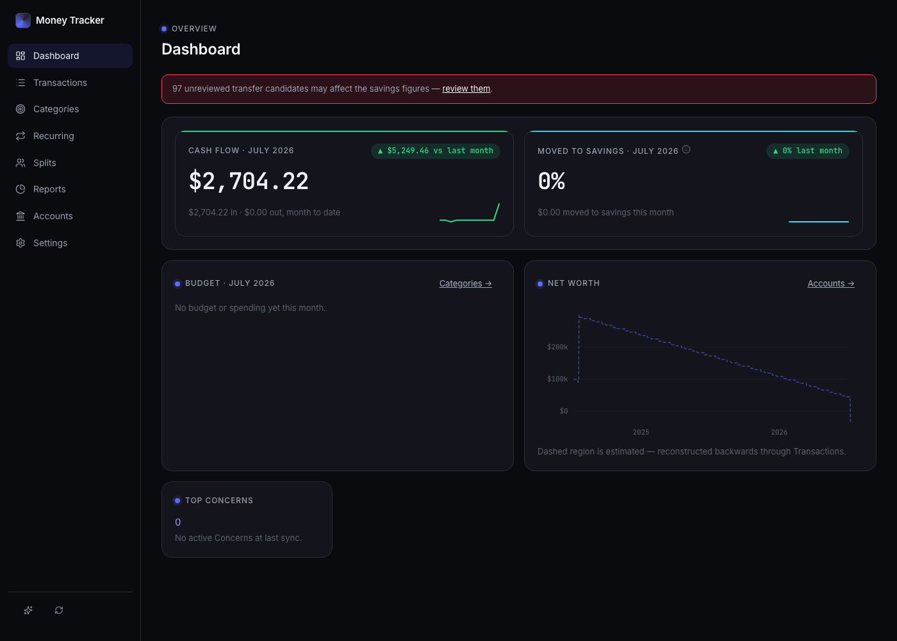
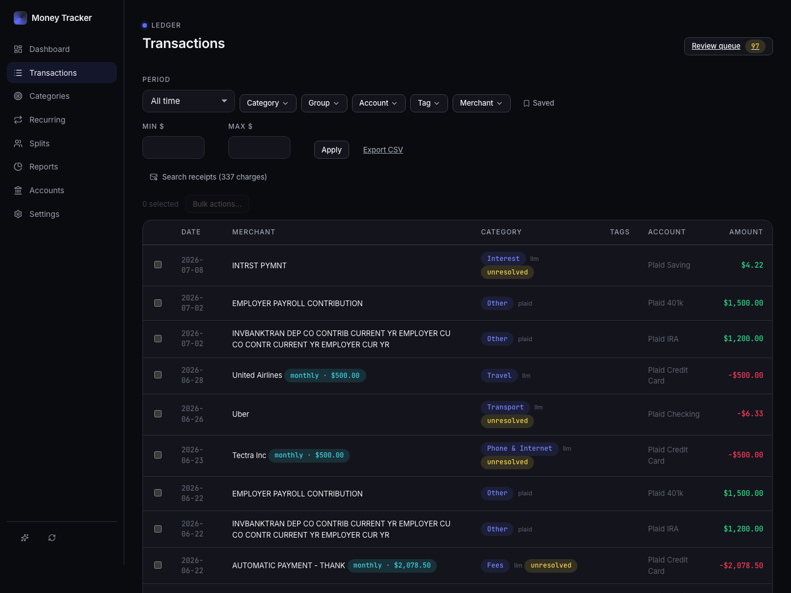
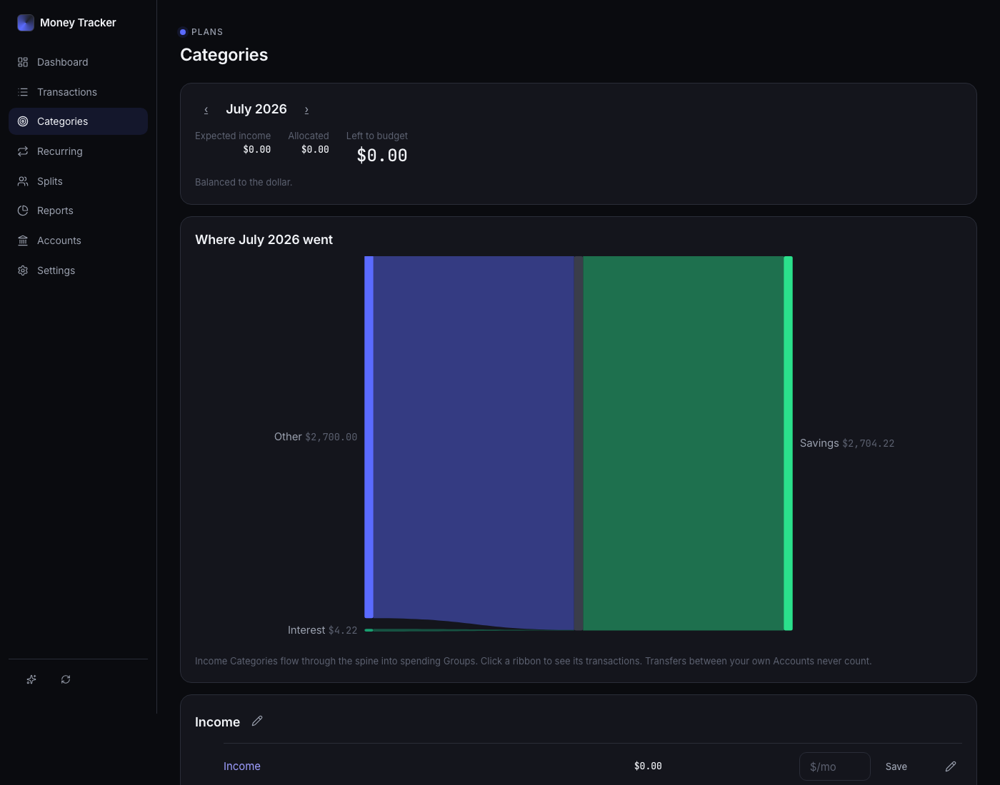
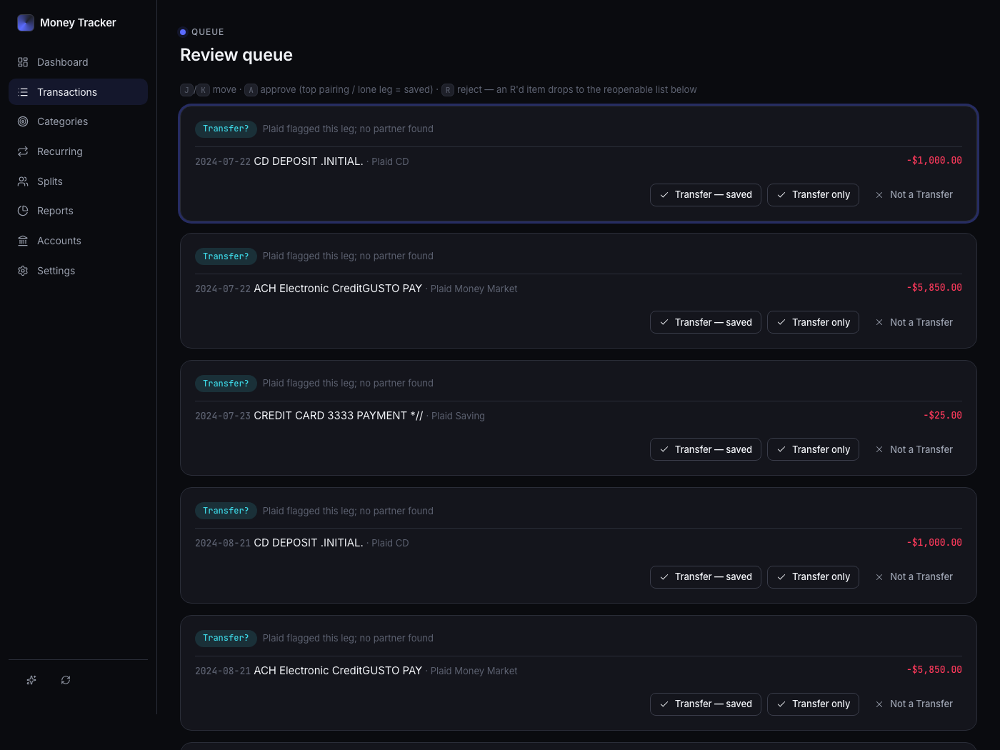
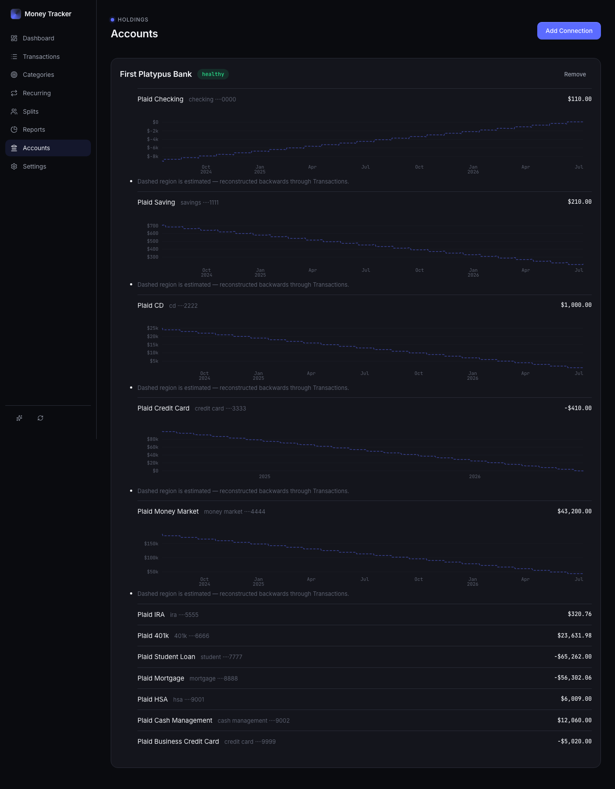

# Money Tracker

[](https://github.com/danielgentile22/money-tracker/actions/workflows/ci.yml)
[](LICENSE)

I wanted Monarch's analytics without handing a startup my bank credentials —
so this is a local-first personal finance tracker for people who feel the same:
bank, investment, and 529 accounts via Plaid, a deterministic categorization
ladder with an LLM rung, Gmail receipt matching, and AI-narrated insights — all
data on your own machine.



*All screenshots show Plaid sandbox data (First Platypus Bank) — no real financial information.*

## Highlights

- **Local-first, zero-egress by design.** All financial data lives in a local
  SQLite file; there is no cloud server, no auth, no telemetry. Exactly three
  deliberately-scoped egress channels exist — Plaid ingestion, an anonymized
  digest to Claude for narration, and read-only Gmail receipt search — each
  documented in [ADR-0001](docs/adr/0001-local-only-data-with-scoped-egress.md).
- **Deterministic money path.** Categorization is a ladder — Rule → Correction →
  LLM → Plaid map → Other — where anything the owner taught the system is never
  second-guessed and history is never re-labeled by a model
  ([ADR-0006](docs/adr/0006-llm-categorization-rung.md)).
- **Enrich then categorize.** Matched Gmail Receipts are distilled into
  structured Receipt facts on the Transaction row; one unified categorizer
  consumes bank evidence plus Receipt facts
  ([ADR-0007](docs/adr/0007-enrich-then-categorize.md)).
- **Transfer detection that keeps analytics honest.** Movements between the
  owner's own Accounts are paired and excluded from spending/income;
  contributions to savings/investment/529 count as saved
  ([ADR-0003](docs/adr/0003-internal-transfers-excluded-contributions-are-saved.md)).
- **Every LLM call goes through one seam** (`Llm`), so the entire receipt and
  insight pipeline is tested against fakes — the test suite never touches the
  network.
- **Decisions are written down.** Eleven [ADRs](ARCHITECTURE.md#adr-index)
  record the real trade-offs: build-vs-buy on aggregators, rules-vs-ML
  categorization, why budgets merged into the Categories page.
- **TypeScript full-stack** — SvelteKit + better-sqlite3 + Observable Plot;
  secrets live in the macOS Keychain, never in the DB or repo.

See [ARCHITECTURE.md](ARCHITECTURE.md) for the system shape and ADR index.

| | |
|---|---|
|  |  |
|  |  |

## Try it in ~5 minutes (sandbox, no real bank)

Plaid's sandbox provides fake institutions and data — no real bank account or
production keys needed.

1. Create a free [Plaid dashboard](https://dashboard.plaid.com) account (Trial
   plan, Transactions + Investments products), then seed the sandbox keys into
   the macOS Keychain:

   ```sh
   security add-generic-password -s money-tracker -a plaid-client-id -w <client_id>
   security add-generic-password -s money-tracker -a plaid-secret-sandbox -w <sandbox_secret>
   ```

2. Install and start:

   ```sh
   npm install
   npm run dev        # → http://localhost:5273 (fixed port)
   ```

3. Open the Accounts surface, click **Add Connection**, and log in with Plaid's
   sandbox credentials `user_good` / `pass_good`. Sync pulls fake transactions
   through the full pipeline: ledger, categorization ladder, transfer pairing,
   analytics.

**What works without any cloud keys:** everything deterministic — sync,
ledger, categorization (Plaid-map floor), transfers, review queue, budgets,
charts, projections, search, CSV export. **What degrades gracefully:** the LLM
categorization rung, Receipt matching, and AI narration slots show
"unavailable" until an Anthropic key / Gmail enrollment is added — ingestion
never blocks on a third party. In sandbox mode the Connection health mark
shows "degraded"; that's cosmetic and expected.

## Run

```sh
npm run dev        # → http://localhost:5273 (fixed port)
npm test           # vitest — money-path modules
npm run check      # svelte-check
```

Data lives in `~/Library/Application Support/Money Tracker/money.db` (SQLite, WAL).
Migrations in `src/lib/server/db/migrations/` apply on boot. Nothing financial or
secret ever lands in this repo.

Start with `PLAN.md` for the locked plan, `CONTEXT.md` for the domain glossary,
and `docs/adr/` for decisions.

## Production setup (once)

Real bank data: add `plaid-secret-production` to the Keychain the same way as
the sandbox secret and start the app with `PLAID_ENV=production npm run dev`.

## Cloud setup (once — email receipts + AI insights)

Optional; without keys everything still runs and narration slots say unavailable.

- **Gmail**: Google Cloud project + OAuth client (Web application), redirect URI
  `http://localhost:5273/inboxes/oauth/callback`, Gmail API + `gmail.readonly`,
  each Gmail as a test user. Seed `google-client-id` / `google-client-secret` in
  the Keychain (commands shown in Settings → Inboxes), then enroll each Inbox there.
- **Anthropic**: API key via Settings → AI (stored in the Keychain).

Going live is: seed the production Plaid secret, enroll each Gmail inbox, add
the Anthropic key, run one production sync, and spot-check the ledger against
the bank's own statement.

## Where things are

- `ARCHITECTURE.md` — system shape, module map, ADR index
- `src/lib/server/` — db, plaid adapter, sync engine, categorizer, transfers,
  balances, corrections, ledger/search/CSV, gmail + matcher + resolution
  (receipt pipeline), digest + insights (pure money-path modules have
  tests alongside as `*.test.ts`; gmail/LLM tested against fakes)
- `src/lib/server/llm.ts` — the `Llm` seam every Anthropic call goes through
- `src/routes/` — the surfaces; `src/lib/halo.css` — Halo design system

## Known limitations

- Default `npm run dev` runs against Plaid's sandbox, which paints a cosmetic
  "degraded" Connection health mark; it self-heals on the first production sync.
- The receipt sweep deliberately fires zero Gmail API calls for charges already
  older than the retry window — a backlog full of "no receipt found" after
  enrollment is correct behavior, not a bug. Old charges use the per-row lookup
  button on /transactions.
- The Google Cloud OAuth app is unverified and capped to test users; each Gmail
  account has to be added as a test user before it can enroll.
- macOS-only in practice: secrets live in the macOS Keychain and the data dir
  is `~/Library/Application Support`.

## Lessons learned

- **Budgets didn't need two modes.** Phase 2 shipped a "Flex mode" budget
  (pool + flex-classes) alongside per-category budgets. Living with both for a
  while made it obvious one model was carrying all the weight, so Flex was
  retired and "delete a category" was rearchitected to mean re-homing its
  transactions, rules, and budget rows (ADR-0008).
- **One categorizer beats a chain of proposers.** The original design had a
  separate receipt-based category proposer feeding the main categorizer.
  Collapsing them into a single categorizer that consumes bank evidence plus
  distilled Receipt facts removed a whole reconciliation layer
  ([ADR-0007](docs/adr/0007-enrich-then-categorize.md)).
- **Write the ceiling down at the cut.** Deliberate simplifications carry a
  `ponytail:` comment naming their ceiling and upgrade path (see
  [ARCHITECTURE.md](ARCHITECTURE.md)) — far cheaper than rediscovering the
  limit in production.

## AI usage

The code was written with Claude Code (Fable 5 / Opus 4.8) working from specs
I wrote —
[`AGENTS.md`](AGENTS.md) is the spec I maintain for the agent, and `PLAN.md` /
the PRDs locked scope before any code was generated. The agent did the
implementation: the sync engine, the categorization ladder, the receipt
pipeline, and the test suite alongside them.

The judgment calls stayed mine, and some went against the agent's output. The
agent built Flex-mode budgets to spec in phase 2; I later reversed that
decision and had it rip Flex out and rearchitect category deletion as
re-homing (ADR-0008). The proposer-chain design for receipts was collapsed
into a single categorizer (ADR-0007). And the `ponytail:` comments through the
source are me capping scope on purpose — each one marks a simplification I
chose, with its known ceiling, rather than complexity the agent wanted to add.
