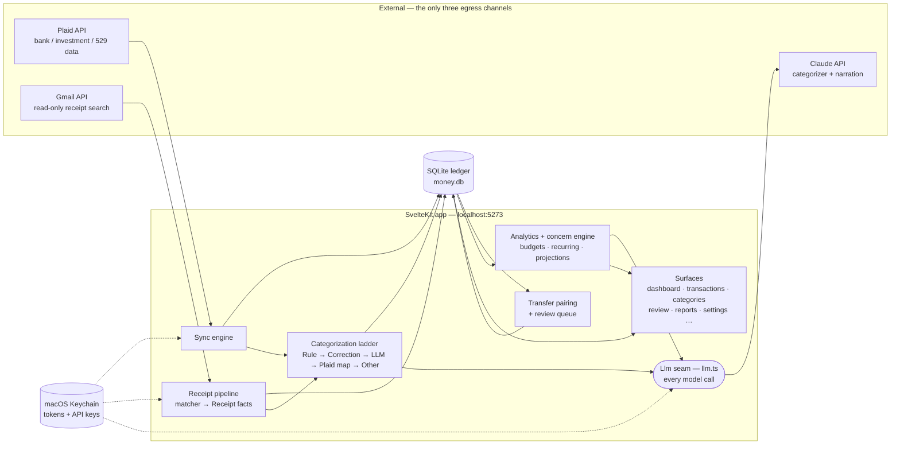

# Architecture

One SvelteKit app in TypeScript, full-stack ([ADR-0002](adr/0002-local-web-app-typescript-fullstack.md)):
server routes own Plaid sync, the categorization ladder, Gmail receipt matching,
and the Anthropic calls; pages render the surfaces and charts (Observable Plot,
Halo design system). All financial data lives in one local SQLite file
(better-sqlite3, WAL); secrets live in the macOS Keychain. There is no cloud
server and no auth — the app is localhost, single-owner, zero-egress except the
three scoped channels below.

In prose: the **sync engine** pulls Transactions and balances from Plaid into
the **SQLite ledger**. Each new Transaction climbs the **categorization
ladder** — a stored Rule or owner Correction always wins; otherwise one batched
LLM call labels the sync's new charges, with Plaid's category map as the
offline floor ([ADR-0006](adr/0006-llm-categorization-rung.md)). Independently,
the **receipt pipeline** searches enrolled Gmail Inboxes for a charge's
Receipt, distills it into Receipt facts on the row, and re-runs the categorizer
for that one Transaction ([ADR-0007](adr/0007-enrich-then-categorize.md)).
**Transfer pairing** matches opposite-sign legs between the owner's own
Accounts and excludes them from spending/income, sending ambiguous pairs to the
review queue ([ADR-0003](adr/0003-internal-transfers-excluded-contributions-are-saved.md)).
The **analytics layer** (budgets, recurring detection, concern engine,
projections) is deterministic SQL + arithmetic over the ledger; only an
anonymized digest ever reaches Claude, for narration. Every model call goes
through the single **`Llm` seam**, so tests run against fakes and never touch
the network.

## ADR index

Real trade-offs, recorded as they were decided:

1. [Local-only data, with three deliberately-scoped egress channels](adr/0001-local-only-data-with-scoped-egress.md) — why a "private, local" app still holds Gmail tokens and calls a cloud LLM.
2. [Local web app, TypeScript full-stack](adr/0002-local-web-app-typescript-fullstack.md) — SvelteKit over Python-split or native shell; Tauri deferred, not rejected.
3. [Internal transfers excluded; contributions are saved](adr/0003-internal-transfers-excluded-contributions-are-saved.md) — the classification rule every analytic depends on.
4. [Plaid as the aggregator; build, don't buy](adr/0004-plaid-aggregator-build-not-buy.md) — the only DIY API reaching investment + 529 data; Teller/SimpleFIN/CSV rejected.
5. [Categorization: Plaid + rules, no custom ML](adr/0005-categorization-plaid-plus-rules-no-ml.md) — superseded by 0006, kept for the reasoning: auditable labels beat a trained classifier.
6. [An LLM rung in the categorization ladder](adr/0006-llm-categorization-rung.md) — one batched call per sync; owner-taught labels never second-guessed; history never re-labeled.
7. [Enrich then categorize](adr/0007-enrich-then-categorize.md) — Receipt facts on the row, one unified categorizer; "at most twice per charge".
8. [Categories page absorbs Budgets and Cash Flow](adr/0008-categories-page-absorbs-budgets-and-cash-flow.md) — month-first consolidation of the owner's primary loop.
